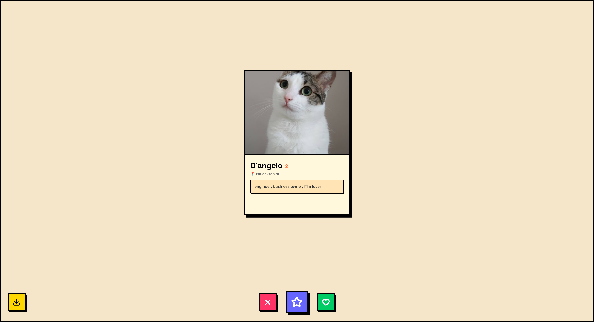

# Cattinder v2

One of my first and big *(to me)* projects was Cattinder which I made around 6 months ago *(as of writing this, and yea thats how new i am)*, and to this day it's my most prized and favorite projects, so I remade it! Now that I am a more sigma dev with slightly more skills and hunger bars at 1, I remade it:

---
EMOJII
## 🚀 How to Run

1. Clone this repo, cd into that repo
2. `npm i`
3. `npm run dev`
4. Enjoy the cats (can download them as jpg too!)

---

## 🛠️ Tech Stack

- **React**
- **Vite**
- **TypeScript**
- **Faker.js** (for fake cat names and bios)
- **CSS**

---

### ✨ Features

- Swipe left/right on cats
- Preloads 2 cards so it feels like you have fast wifi
- Random cat pics, names, location (hm), and bios (thanks, [Cataas](https://cataas.com/), [Faker](https://fakerjs.dev/), [TestingBot](https://testingbot.com/free-online-tools/random-address-generator))

---

*i havent ate in 8 hours and i is now regretting life choices*
